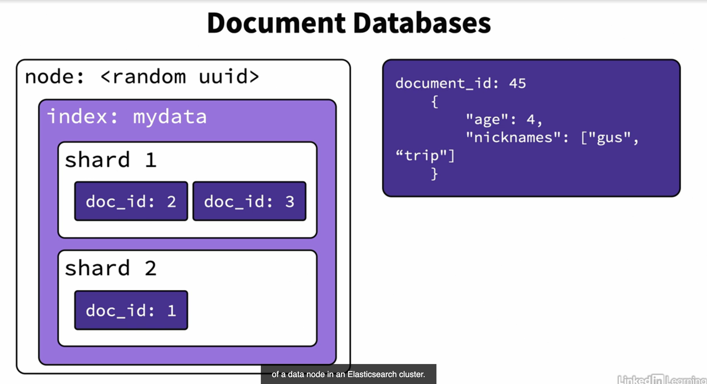
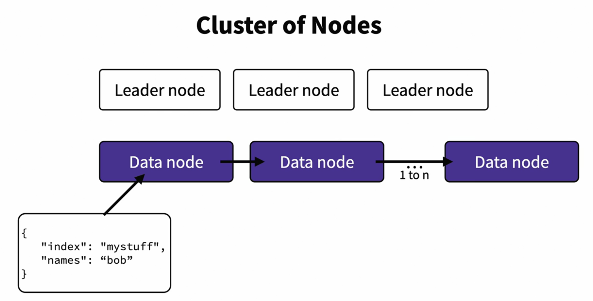
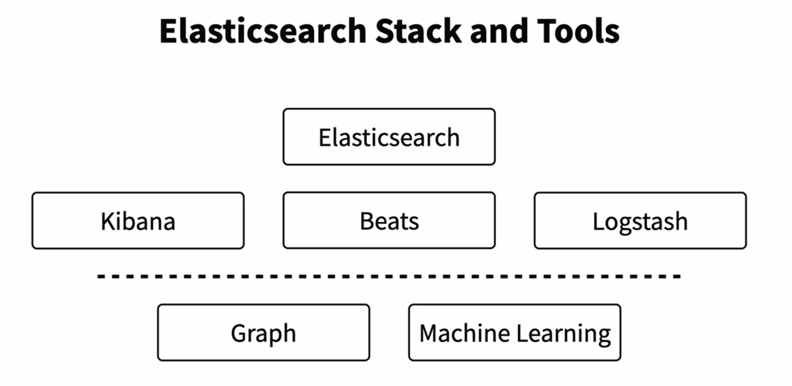

# Elasticsearch in Depth


What Is Elasticsearch?
- Fully distributed data store.    
- Nodes (computers) working in conert.   
- Document data store with JSON.     


What is Apache Lucene?
- Specialized database engine.  
- Search structed data and text blocks.   
- Document database - not as standardized as SQL.   

Doucment Databases.    


How Cluster of Nodes Work?      
- Leader node - in charge of shards.    
- Data node - hold the data itself.    
- Leaders are distributed for redundancy.    
- Data nodes are assigned as needed.     
- Indexes have a shard count and a replication factor.    








**Relational Databases**
- Established design theory
- Possible one-to-one, one-to-many,     
  and many-to-many relationships    
- Good documentation

**Document Databases**      
- Not very common    
- NoSQL     
- Manual normalization   
- Content organization     


## [Reference].    

- [Download Elasticsearch](https://www.elastic.co/kr/downloads/elasticsearch)    
```bin/elasticsearch```
- [Download Kibana](https://www.elastic.co/kr/downloads/kibana)  
```bin/kibana```

- [Install Elasticsearch on MacOs with Homebrew](https://www.elastic.co/guide/en/elasticsearch/reference/7.17/brew.html#brew)
